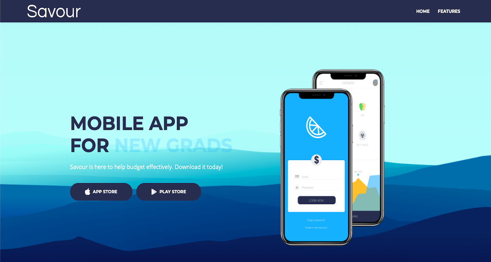
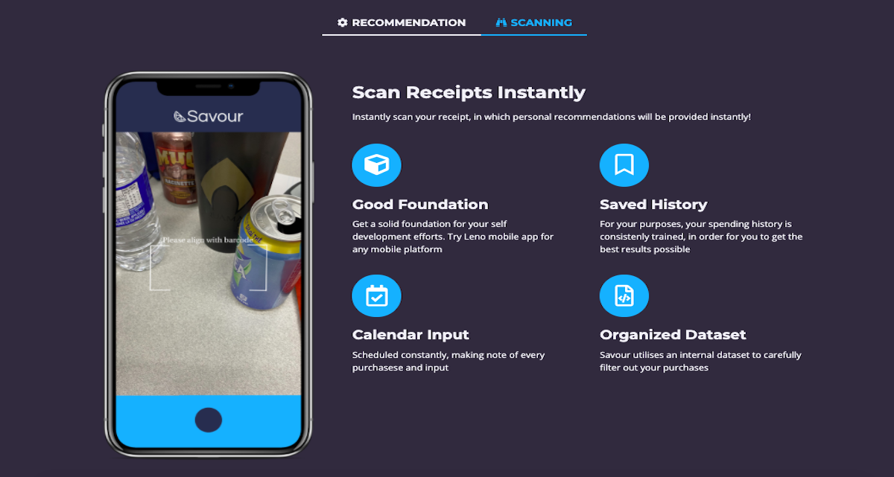
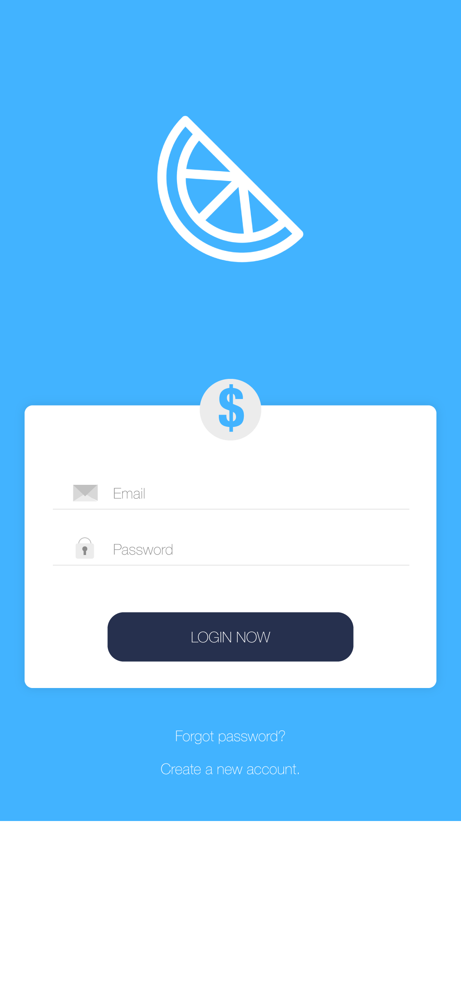

# Savour-DeltaHacks-VI

### About
Savour was a project created for DeltaHacks, by Oliver, Evan, Nephthalim, and Zach. Essentially, this application scans are reciepts and recommends ways that a user can save money. With many budgeting apps, users just see how much they spend. This app acts as a call to action, in which tips can be displayed according to previous purchases.

#### Display and UI Design

#### Scanning Feature

#### Login (By Evan Wong)

